# Streamable HTTP

As the Model Context Protocol (MCP) evolves, developers are moving from the legacy **HTTP+SSE** transport to the more modern and robust **Streamable HTTP**. 

---

## ✅ MCP New Streamable HTTP (Modern Transport) - Sequence Diagram

```mermaid
sequenceDiagram
  participant Client
  participant Server

  %% === Initialization Phase ===
  rect rgb(240, 240, 240)
    note left of Client: Initialization

    Client->>Server: POST /mcp InitializeRequest<br><br>Accept: application/json & text/event-stream<br>No Mcp-Session-Id<br>... request ...
    activate Server

    Server-->>Client: InitializeResponse<br>Mcp-Session-Id<br>... response (InitializeResult) ...
    deactivate Server

    Client->>Server: POST /mcp InitializedNotification<br>Mcp-Session-Id<br>... notification ...
    activate Server

    Server-->>Client: 202 Accepted (no body)
    deactivate Server

  end

  %% === Client Request ===
  rect rgb(230, 250, 230)
    note left of Client: Client request
    Client->>Server: POST /mcp<br>Mcp-Session-Id<br>Accept: application/json, text/event-stream<br>body:... request ...
    activate Server
    alt
      note left of Client: Server option 1: Single response
      Server-->>Client: Content-Type: application/json<br>...response: one JSON object ...
    else 
      note left of Client: Server option 2: Open SSE stream
      Server--)Client: Content-Type: text/event-stream
      loop
        Server--)Client: ... SSE messages from server ...
        opt
          note left of Client: Input required
          Server->>Client: ... Input requests ...
          activate Client
          Client-->>Server: ... Input responses ...
          deactivate Client
          note left of Client: Notifications
          Server->>Client: JSON-RPC notifications  
        end
      end
      Server-)Client: SSE event: ... response ...
      Server-)Client: Close SSE stream
    end
    deactivate Server
  end

  %% === Client Notifications/Responses ===
  rect rgb(255, 250, 220)
    note left of Client: Client notifications/responses
    Client->>Server: POST /mcp<br>... notifications/response ...
    activate Server
    alt
      note left of Client: Server accepts
      Server-->>Client: 202 Accepted (no body)
    else
      note left of Client: Server cannot accept
      Server-->>Client: 400 Bad Request, optional JSON-RPC error response
    end
    deactivate Server
  end

  %% === Listening for Messages from the Server ===
  rect rgb(245, 230, 255)
    note left of Client: Listening for messages from the server
    Client->>Server: GET /mcp<br>Accept: text/event-stream<br>Mcp-Session-Id
    activate Server
    alt 
      note left of Client: SSE supported - open SSE stream
      Server--)Client: Content-Type: text/event-stream
      loop
        Server--)Client: ... SSE messages from server
        opt
          note left of Client: Input required
          Server->>Client: ... Input requests ...
          activate Client
          Client-->>Server: ... Input responses ...
          deactivate Client
          note left of Client: Notifications
          Server->>Client: JSON-RPC notifications 
        end
      end
    else
      note left of Client: SSE not supported
      Server-->>Client: 405 Method Not Allowed
    end
    deactivate Server
  end

  %% === Session Management ===
  rect rgb(255, 230, 230)
    note left of Client: Session handling
    opt 
      note left of Client: Resume after disconnect
      Client->>Server: GET /mcp with Last-Event-ID
      activate Server
      Server-->>Client: Resume from last event
      deactivate Server
    end
    opt 
      note left of Client: Server ends session or invalid/expired session
      Client->>Server: ... request with closed session ID ...
      activate Server
      Server-->>Client: ... HTTP 404 Not Found response ...
      deactivate Server
      activate Client
      Client->>Server: ... Start new session - InitializeRequest ...
      deactivate Client
    end

    opt
      note left of Client: Client ends session
      Client->>Server: DELETE /mcp Mcp-Session-Id
      activate Server
      alt
        note left of Client: Allowed
        Server-->>Client: 204 No Content
      else
        note left of Client: Not allowed
        Server-->>Client: 405 Method Not Allowed
      end
      deactivate Server
    end
  end
```

